# AXI-Lite FPGA Hardware Accelerators

## Overview

Two AXI4-Lite controlled hardware accelerator blocks designed for a 1 kHz optical sensor acquisition pipeline on Xilinx Artix-7. Each block runs in parallel with an existing ADC → FIFO → UART pipeline, offloading signal processing from firmware into FPGA fabric and exposing results via memory-mapped registers.

The existing pipeline streams raw 12-bit ADC samples over UART to a host PC. These accelerators add on-chip computation — noise filtering and threshold detection — without modifying the original data path.

---

## Architecture


---

## Blocks

### Moving Average Filter (`moving_avg_filter/`)
- Configurable sliding window (1–16 samples, power-of-2)
- Running accumulator — no multiplier, no divider, just adds and shifts
- Warmup-aware: divides by fill count until window is full
- 1-cycle result latency after DATA_IN write
- IRQ pulse on every new filtered result
- Header-only C driver with init, push, read, clear API

### Threshold Comparator with IRQ (`threshold_comparator/`)
- Configurable high/low threshold band with hysteresis
- Three trigger modes: ABOVE, BELOW, BOTH (configurable via register)
- Latched IRQ — firmware must explicitly acknowledge via CTRL[2]
- 3-state FSM: ARMED → TRIPPED_HI / TRIPPED_LO
- Auto re-arms when signal exits the opposite band
- Auto-resets state machine on direction change
- Header-only C driver with ISR-ready clear pattern

---

## Implementation Results (xc7a200t-fbg676-2)

Full integrated design (pipeline + both accelerators):

| Resource     | Used | Available | Util % |
|--------------|------|-----------|--------|
| Slice LUTs   | 162  | 134,600   | 0.12%  |
| Slice FFs    | 339  | 269,200   | 0.13%  |
| DSPs         | 0    | 740       | 0.00%  |
| BRAMs        | 0    | 365       | 0.00%  |

Longest routed data path: **4.38 ns** — comfortable margin at 100 MHz (10 ns period).

---

## Verification

| Block                | Tests | Result |
|----------------------|-------|--------|
| Moving Average Filter | 15/15 | ✅ All passing |
| Threshold Comparator  | 21/21 | ✅ All passing |

Testbenches are self-checking — each test prints `[PASS]` or `[FAIL]` with expected vs got values. VCD dump compatible for GTKWave inspection.

**Moving average tests cover:** reset, register R/W, correctness across 8 samples (warmup + steady state), mid-stream clear, window reconfiguration, IRQ pulse.

**Threshold comparator tests cover:** reset, register R/W, ABOVE mode (fire, latch, re-arm), BELOW mode, BOTH mode (bidirectional with hysteresis), no spurious IRQ inside band, exact boundary condition (`>` not `>=`).

---

## Repository Structure

```
├── moving_avg_filter/
│   ├── rtl/
│   │   └── axi_moving_avg.v        Verilog-2005 RTL
│   ├── firmware/
│   │   └── moving_avg_drv.h        Header-only C driver
│   ├── tb/
│   │   └── tb_axi_moving_avg.sv    Self-checking SV testbench
│   └── docs/
│       └── register_map.md         Full register spec + timing diagram
│
├── threshold_comparator/
│   ├── rtl/
│   │   └── thresh_comparator.v     Verilog-2005 RTL
│   ├── firmware/
│   │   └── thresh_cmp_drv.h        Header-only C driver
│   ├── tb/
│   │   └── tb_thresh_comparator.sv Self-checking SV testbench
│   └── docs/
│       └── register_map.md         Full register spec + state machine diagram
│
└── integration/
    └── rtl/
        ├── top.v                   Top-level integrating pipeline + accelerators
        └── axil_master_stub.v      Minimal AXI-Lite master state machine
```

---

## Tools

| Tool | Version |
|------|---------|
| RTL  | Verilog-2005 |
| Testbenches | SystemVerilog |
| Simulator / Synthesizer | Vivado 2025.1 |
| Target FPGA | Xilinx Artix-7 xc7a200t |

---

## Key Design Decisions

**Why power-of-2 window sizes only?**  
Division by an arbitrary integer requires a hardware divider (DSP or LUT-based), adding latency and resource cost. Power-of-2 division is a free arithmetic right-shift. Non-power-of-2 support is a natural extension.

**Why warmup-aware division?**  
During the first N samples the accumulator hasn't seen a full window yet. Dividing by N would attenuate early results. Dividing by the actual fill count gives a true running average from sample 1.

**Why latched IRQ on the threshold comparator?**  
A 1-cycle pulse IRQ (like the moving average) can be missed if firmware is busy. A threshold crossing is an alarm event — it must persist until firmware explicitly acknowledges it. This matches how real sensor alarm circuits behave.

**Why hysteresis?**  
A single threshold would cause the IRQ to re-fire on every sample when a noisy signal hovers near the boundary. The high/low band forces the signal to travel across the full band before re-arming — standard practice in analog comparator design, replicated here in RTL.

---

## Integration

`integration/rtl/top.v` shows how both accelerators connect in parallel
with an existing sensor acquisition pipeline (ADC → FIFO → UART).
The pipeline source files are not included here — `top.v` is provided
as a wiring reference. To synthesize the full design, bring your own
ADC interface, FIFO, and UART modules and connect them to the port list
in `top.v`.

The accelerator blocks (`axi_moving_avg.v`, `thresh_comparator.v`) are
fully standalone and can be simulated independently using the provided
testbenches without any external dependencies.